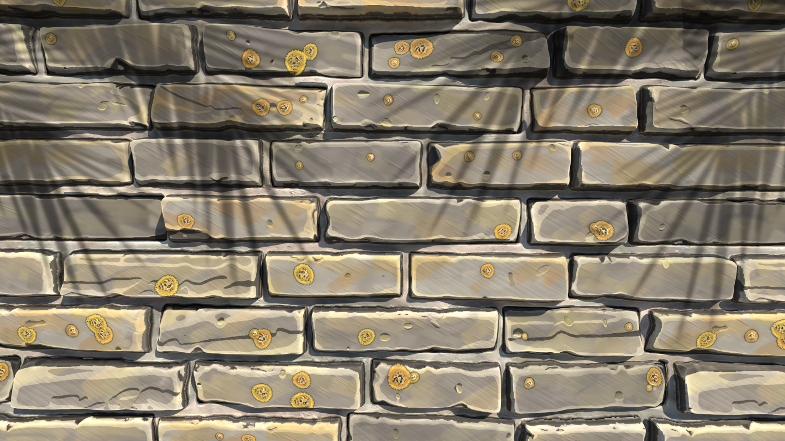
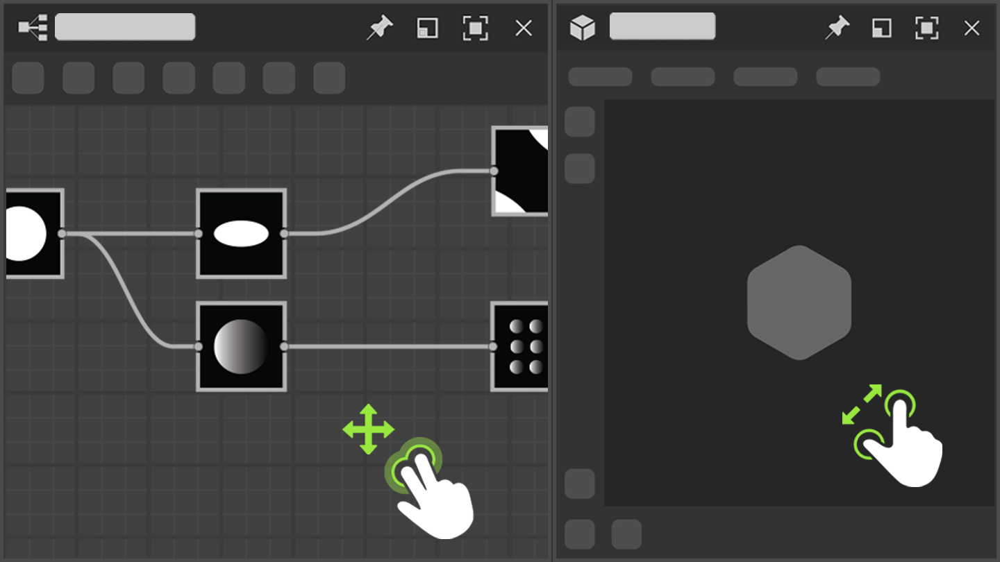

# A new set of nodes around colors...
A new set of nodes dedicated to color manipulation: reduce the number of colors in an image and extract a palette from it, build your own color palette and apply it to another image using an ID map, plus an Anisotropic Kuwahara filter to generate some painterly styles! 

# ...and much more content!
This new update also includes a bunch of new nodes:
- Curvature Smooth (new version) now correctly supports all tilings modes, adds two new outputs (convexity and concavity) and improves both in accuracy and performance.
- Bevel Smooth improves on the Bevel node with smoother results and more capabilities for gradients created around shapes
- Directional Distance produces a gradient from shape's borders in a specific direction
- Normal Uncombine removes from a normal map the details provided by a height map

# Work more efficiently
Performance and responsiveness when working on big projects have been improved. For example removing nodes can be up to 75 times faster.
On Mac, trackpad support has been completely reworked to be more natural and in line with other software.
Finally, moving nodes beyond the borders of the Graph View is now smoother and more consistent.

