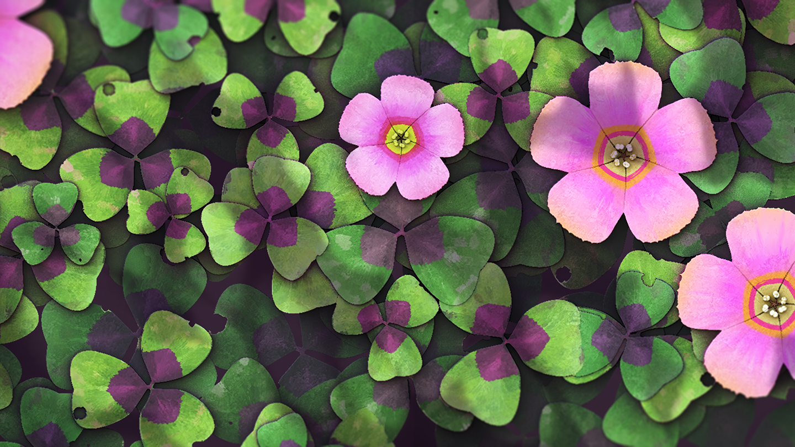

# Neuer Satz Knoten rund um Farben...
Neuer Satz Knoten speziell für die Farbbearbeitung: Reduzieren Sie die Anzahl der Farben in einem Bild oder extrahieren Sie eine Palette aus ihm. Erstellen Sie eine eigene Farbpalette und wenden Sie sie mit einer ID-Map auf ein anderes Bild an. Zusätzlich wurde ein anisotroper Kuwahara-Filter zum Generieren einiger malerischer Stile eingeführt. 

# ... und vieles mehr!
Mit diesem neuen Update werden auch einige neue Knoten eingeführt:
- Krümmungsglättung (neue Version) unterstützt jetzt alle Kachelmodi ordnungsgemäß und hat zwei neue Ausgaben (Konvexität und Konkavität) sowie sowohl verbesserte Genauigkeit als auch Performance.
- „Glättung für abgeflachte Kante“ verbessert den Knoten „Abgeflachte Kante“ durch glattere Ergebnisse und mehr Funktionen für um Formen herum erstellte Verläufe
- „Richtungsabstand“ erzeugt einen Verlauf von den Begrenzungslinien der Form in eine bestimmte Richtung
- „Zusammenführung von Normalen aufheben“ entfernt die aus einer Höhen-Map stammenden Details aus einer Normalen-Map.

# Effizientere Arbeit
Die Performance und Reaktionsschnelligkeit bei der Arbeit an großen Projekten wurden verbessert. Das Entfernen von Knoten ist beispielsweise bis zu 75 mal schneller.
Die Trackpad-Unterstützung für Macs wurde komplett überarbeitet und ist nun natürlicher und ähnlicher zu der bei anderer Software.
Schließlich können Knoten jetzt glatter und konsistenter über die Grenzen der Graphansicht hinaus verschoben werden.
![visual] (feature_3.png)