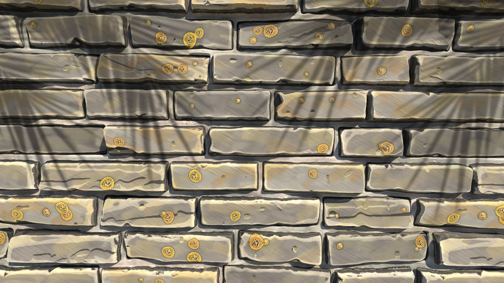

# Un nuevo conjunto de nodos alrededor de colores...
Un nuevo conjunto de nodos dedicados a la manipulación del color: reduzca la cantidad de colores de una imagen y extraiga una paleta a partir de ella, cree su propia paleta de colores y aplíquela en otra imagen mediante un mapa de identificación, además de un filtro Kuwahara anisotrópico para generar algunos estilos pictóricos.

# ¡y mucho más contenido!
Esta nueva actualización también incluye muchos nodos nuevos:
- Suavizado de curvatura (nueva versión) ahora es compatible con todos los modos de mosaico, añade dos nuevas salidas (convexidad y concavidad) y mejora la precisión y el rendimiento.
- Suavizado de bisel mejora el nodo de bisel con resultados más uniformes y más capacidades para los degradados en torno a las formas
- La distancia direccional produce un degradado de los bordes de la forma en una dirección concreta
- Separación de normales borra los detalles de un mapa de normales proporcionados por un mapa de altura

# Trabaje de manera más eficiente
Se han mejorado el rendimiento y la adaptabilidad al trabajar en proyectos grandes. Por ejemplo, el borrado de nodos puede ser hasta 75 veces más rápido.
En Mac, la compatibilidad con el panel táctil se ha modificado completamente para que sea más natural y coherente con otros software.
Por último, el desplazamiento de los nodos fuera de los bordes de la vista de gráfico es mucho más suave y eficiente.
